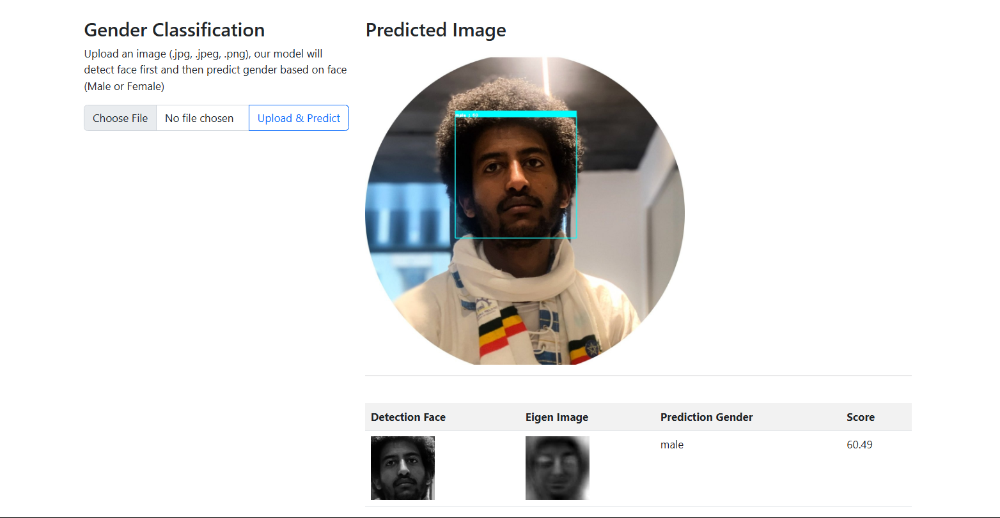
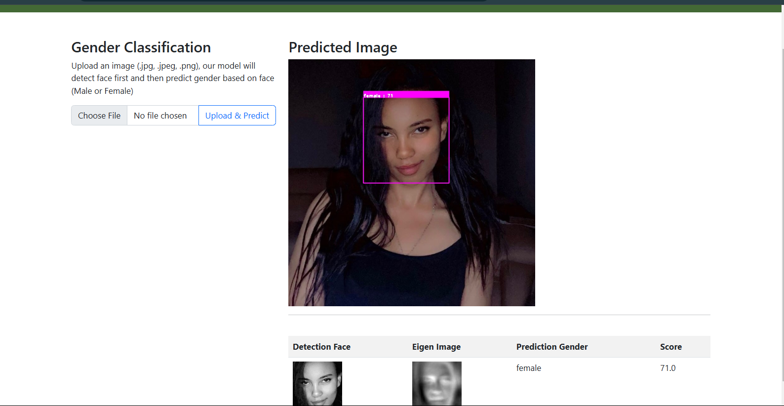
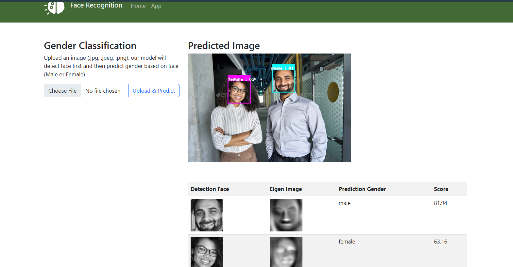

  # Welcome to My Face Recognition Web App Project

This project showcases my journey of developing an end-to-end face recognition system. It covers both machine learning and web development aspects, breaking down the process into two main phases:


---

## Modules Overview

In the first phase, I focused on training the machine learning model for face recognition, learning the intricacies of data handling and model training. The second phase involved developing a web application (API) using Flask to integrate and serve the model to users.

---

### 1. Training the Face Recognition Model

To build a reliable face recognition system, I followed a systematic approach that involved these key steps:

#### Data Gathering
- Collected a diverse dataset of facial images to ensure accurate recognition across various demographics.

#### Data Preprocessing
- Applied techniques such as resizing, normalization, and data augmentation to enhance the dataset.

#### Feature Engineering
- Extracted key features using OpenCV and dlib for face detection and alignment.

#### Building the Machine Learning Model
- Trained a face recognition model using state-of-the-art algorithms to achieve high accuracy.

#### Creating the ML Pipeline
- Designed a modular pipeline for streamlined training and testing processes.


---

## Visual Demonstrations

### 1. Website Screenshot
Below is a screenshot of the main page of the application:


---

### 2. Tested Results
Here are two examples of tested results showcasing the app's functionalities:

### Results

Below are the results of the face recognition test:

#### Result 1:Single face detected(Male)


#### Result 2: Single face detected (Female)


#### Result 3: Two faces detected


---

### 3. Video Demonstrations
To see the app in action, watch the following video demonstrations:

- **Video 1**: [https://www.youtube.com/watch?v=EQILXt0xKrk]( Face Recognition Web App)
<!-- - **Video 2**: [Link to video demonstration 2](#) -->

---

Let me know if you'd like help formatting the images or videos, or if you'd like to add more content!


## Project Structure
The project is organized into the following directories and files:

```
notebooks
app
    face_recognition.py
    views.py
model
    pca_dict.pickle
    model_svm.pickle
    haarcascade
static
    images
    predict
    upload
templates
    app.html
    base.html
    gender.html
    index.html
test_image
main.py
procfile
aptfile
```

### Folder Details
- **notebooks**: Contains Jupyter Notebooks used during the model training phase.
- **app**: Includes the core Flask application files.
  - `face_recognition.py`: Implements the face recognition logic.
  - `views.py`: Handles the web application views.
- **model**: Stores the trained models and other resources.
  - `pca_dict.pickle`: Pickled PCA transformation data.
  - `model_svm.pickle`: Pickled SVM classifier for face recognition.
  - `haarcascade`: Haarcascade files for face detection.
- **static**: Contains static assets such as images and uploaded files.
  - `images`: General images for the app.
  - `predict`: Directory for prediction-related files.
  - `upload`: Directory for user-uploaded files.
- **templates**: Contains HTML templates for the web application.
  - `app.html`: Main application page.
  - `base.html`: Base layout template.
  - `gender.html`: Gender classification page.
  - `index.html`: Home page.
- **test_image**: Directory for storing test images.
- **main.py**: Entry point for the Flask application.
- **procfile**: Configuration for deploying to platforms like Heroku.
- **aptfile**: Specifies system-level dependencies for deployment.

---
## Requirements
To run this project, you will need the following Python packages:

- `numpy`
- `opencv-python`
- `matplotlib`
- `flask`
- `html`


You can install the required packages using pip:

## Usage
1. **Prepare Your Data**: Place your images in the `data/female/` and `data/male/` directories.
2. **Run the Notebook**: Open `1_data_process.ipynb` in Jupyter Notebook and execute the cells sequentially. The notebook will:
   - Load images from the specified directories.
   - Detect faces using the Haar Cascade classifier.
   - Crop and save the detected faces into the `crop_data/females/` and `crop_data/males/` directories.

3. **Check Output**: After processing, the cropped images will be saved in the respective directories. You can verify the number of images processed by checking the output in the notebook.


## Notes
- Ensure that the Haar Cascade model file is correctly placed in the `model/` directory.
- The project is designed to handle images in `.jpg` format. Ensure your input images are in this format.
- The code includes error handling for unreadable images, which will be logged in the output.

## License
This project is licensed under the MIT License. See the LICENSE file for more details.

## Acknowledgments
- OpenCV for computer vision tasks.
- Jupyter Notebook for interactive coding and visualization.
- `IMDB-WIKI Dataset`: A large dataset of celebrity images, which can be used for training and testing face recognition models. You can download the dataset from [here](https://data.vision.ee.ethz.ch/cvl/rrothe/imdb-wiki/).
